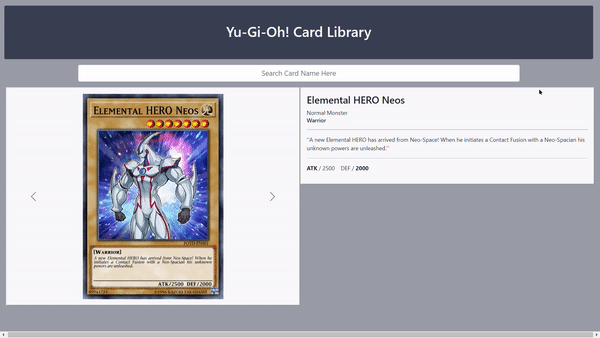
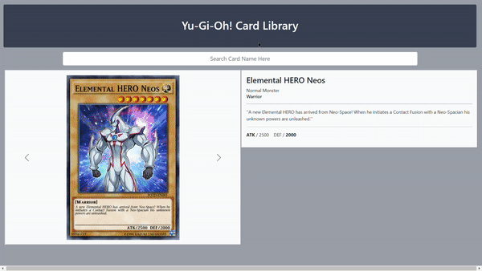

# Yu-Gi-Oh! Card Library Project

This is a single page application that functions as a Yu-Gi-Oh! card library. Just search the card by name, and you will be given a list of card names that match your search!

Created With:
- HTML, CSS, and JavaScript
- Bootstrap 5 Framework
- Fetch Endpoint: Yu-Gi-Oh! API by [YGOPRODeck](https://db.ygoprodeck.com/api-guide/)

##Installation

To Test Yourself:
- Click this [CodeSandbox Link]().
- Or download repository contents and run in a local development server.

## Preview
Alternate Card Art Demonstration:

Card Search Demonstration:

